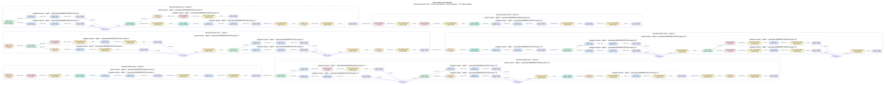

# Complex concurrent plan

This deliberately topology-rich Codex profile is a visual example, not a calibrated production preset. It uses six finite top-level session trees over three closed-loop streams, tool and parallel-tool turns, single-child delegation, swarms, blocking and non-blocking continuations, compaction attempts, and stream restarts.



Regenerate the graph with Graphviz installed:

```bash
cargo run -- plan \
  --config examples/complex-concurrency/complex-concurrency.toml \
  --output /tmp/complex-concurrency-plan
```

The included `plan.dot` is the canonical graph source. `plan.svg` was rendered by Graphviz 2.43.0. The seeded plan contains 119 requests across 26 protocol sessions: six configured top-level trees and 20 generated child sessions. It has 29 logical compactions, each with one physical attempt because synthetic abort and retry injection are disabled. Its seven multi-child joins converge on diamonds so the post-join delay is shown exactly once.
